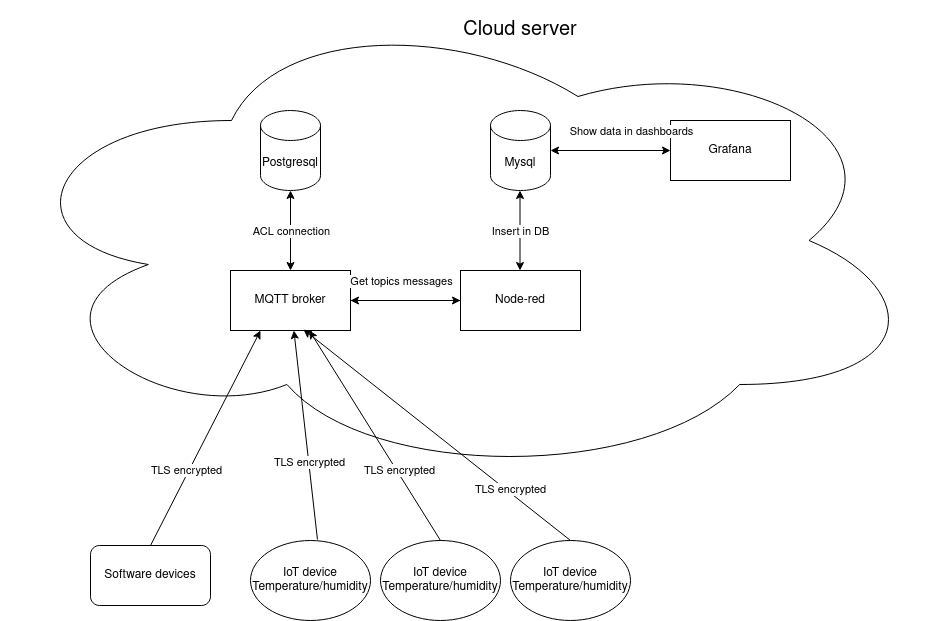
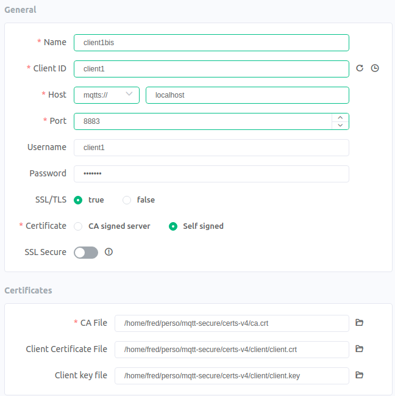
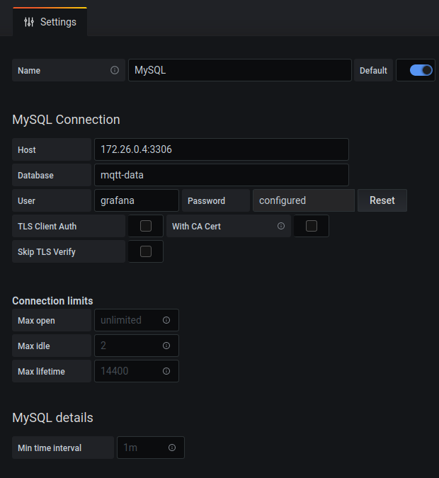

# IOT Secured

IoT secured stack

Global schema of infrastructure 



## SECURITY

### MQTT BROKER 

The MQTT broker has authentication and TLS certificates to log and communicate between clients. To do so, see the picture below to connect to it. 

#### TLS OPTION and ACLs AUTH

The client configuration needs to be like this in MQTTX: 



### NODE-RED

Node-red is the service that allows to connect to the mqtt broker, get messages, and transfer data to the MariaDB database. 

#### AUTH with username/password

The configuration supports two users: 

* `guilhem` : for Guilhem user
* `fred` : for Frédéric user

To be able to connect, you should execute this command for each user : 

```bash
docker exec -it node-red npx node-red admin hash-pw <user>
```
A command prompt asks for the password you want to give to the user. 

Then you need to copy these hashes and past into you `.env` file and source it :

```bash
source .env
```

The you can log-in to the node-red web interface at `1880` port. 

### Grafana dashboarding 

Grafana is the graphical interface that allows to see data from mqtt devices. 

#### Grafana configuration

##### First login 

At first, go to the grafana endpoint address : `localhost:3000` 
Set username/password : `admin`/`admin` at first, then grafana will ask for a new password, set what you want. 

##### Add data source 

Then go on `Configuration` section (on the left of the window) and go on `Data Sources`. Click on `Add data source`, then select `Mysql` and add parameters like below : 


The `Password` is that one present in the `mariadb/schemas/mqtt-users.sql` for grafana user -> `grafana-password`. 

##### Add dashboard 

The last step is to add the dashboard to see mqtt data. 
At first, go on `Create` logo (on the left of the windows) and click on `Import`. Click on `Upload JSON file` and get the dashboard JSON file in `grafana/provisioning/dashboards/temperature_humidity_dashboard.json` file. Finish with `Import` button. 

You now have a fresh installation of the entire stack. Enjoy !